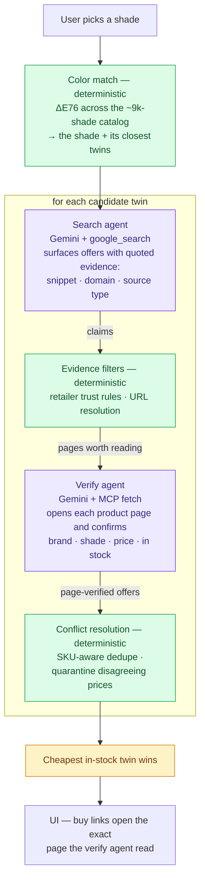

# Find Your Lipstick Twin — dupe price-finder

My capstone for Kaggle's [**5-Day AI Agents Intensive Course with
Google**](https://www.kaggle.com/learn-guide/5-day-agents).

A two-agent Gemini pipeline that takes a lipstick shade, finds its perceptual "twins," and returns live, page-verified prices so the cheapest
in-stock dupe wins.

## Course concepts demonstrated

| Key concept | Where | What to look at |
|---|---|---|
| **Agent / multi-agent system (ADK)** | Code | Two ADK `LlmAgent`s — a search agent with `google_search` ([pipeline.py:267](src/backend/pipeline.py#L267)) and a page-verification agent ([pipeline.py:317](src/backend/pipeline.py#L317)) — sequenced by deterministic Python. Rationale in [Why agents?](#why-agents), design in [Architecture](#architecture). |
| **MCP server** | Code | The verification agent's only tool is the `fetch` MCP server, run over stdio via ADK's `McpToolset` ([pipeline.py:274](src/backend/pipeline.py#L274)). It loads each candidate product page to confirm brand and shade before a price can win. |
| **Deployability** | Video + code | The whole system — backend, UI, and MCP fetch server — ships as one Docker container ([docker/](docker/)); build-and-run is two commands ([Run it yourself](#run-it-yourself)) and is shown working in the video. |
| **Security features** | Code | The API key is never stored in the repo or the image: `.env` is gitignored and the container prompts for the key with hidden input ([entrypoint.sh](docker/entrypoint.sh)). Fetched retailer pages are treated as untrusted input — deterministic verification ([pipeline.py:680](src/backend/pipeline.py#L680)) decides what a page can claim, so page content can't steer the final pick. |

The video follows the same arc as this README: [the problem](#the-problem) →
[why agents](#why-agents) → [architecture](#architecture) → live
[demo](#demo) → [the build](#the-build).

**TL;DR:**

- **[The problem](#the-problem)** — Buying lipstick by color is broken: shade
  names tell you nothing, and store filters are too coarse to find a match. My
  earlier project already solves the color side, so the hard part left is
  getting a **price you can trust, right now**.
- **[Why agents?](#why-agents)** — Instead of maintaining a giant catalog that's
  stale the day it ships, an agent prices just the few shades you asked about,
  live — including whether each one is still in stock or has been discontinued.
  And deciding whether a result is real — in stock, the same product, an actual
  store — is a judgment call that needs a model, not a rule.
- **[Architecture](#architecture)** — One agent searches the web for offers,
  a second opens each product page to confirm the brand and shade really match,
  and plain Python weighs what they find and picks the cheapest in-stock twin.
- **[Demo](#demo)** — Run it locally, open the page, and pick a shade; you get
  page-verified prices in a minute or two. Repeat runs are instant thanks to a
  6-hour cache.
- **[The build](#the-build)** — Google's Agent Development Kit and an MCP fetch
  tool, color-distance math over a ~9k-product catalog, a FastAPI backend, and a
  no-build web UI. It started in a notebook and moved into a real backend.

## Contents

- [The problem](#the-problem)
- [Why agents?](#why-agents)
- [Architecture](#architecture)
- [Demo](#demo)
- [The build](#the-build)
- [How I built it](#how-i-built-it)
- [How well it works](#how-well-it-works)
- [What I learned](#what-i-learned)
- [Observability notes](#observability-notes)

## The problem

Lipstick is a ~$17B market growing to a projected ~$24B by 2030, and shopping
it by color is broken:

- **Shade names don't describe colors.** Brands name shades "Velvet Plum,"
  "Midnight Berry," "Spiced Rosewood" — evocative, but they don't map to a
  color. Even shades sharing a name ("mauve") are visibly different colors
  across brands.
- **Retailer filters are too coarse to help.** Sephora collapses the entire
  spectrum into 14 color groups, Ulta into 12; one tap on Ulta's "Pink" filter
  returns **641 products** spanning pale rose to near-red. Amazon and Google
  Shopping have no color filter at all — you need makeup vocabulary
  ("terracotta"? "dusty rose"?) before you can even type a search.
- So the question every shopper actually has, *"is there a cheaper product in
  this exact color?"*, has no tool. In practice people buy-and-swatch, or
  trust years-old blog "dupe lists."

My previous project, [Lipstick Color Finder](https://github.com/ConstanzaSchibber/lipstick_color_extraction)
([live app](https://lipstickbycolor.github.io/)), solved the **color half**:
an ML pipeline that extracts each product's true color as a [CIELAB coordinate](https://lipstickbycolor.github.io/color-guide.html)
across 9,000+ products, so shades can be compared by measured color difference
(ΔE) instead of by name. Below ΔE ≈ 2, two shades are literally
indistinguishable to the human eye: perceptual twins.

Solving the color half exposes the **price half**, and that's this project.
Once you know a $34 MAC shade has a $9 drugstore twin, color is a tie and
**price is the only tiebreaker that matters** — but getting a price you can
act on is genuinely hard:

- Prices change daily and vary by retailer, and brands discontinue shades all
  the time. Keeping prices and availability current for 9,000+ products across
  hundreds of retailers is infeasible — any pre-built price catalog is stale
  the day it ships.
- The web is full of *claimed* prices — blog posts, review sites, years-old
  "dupe lists" — that aren't places you can actually buy the product.
- Listings go out of stock, retailers hide product pages behind bot-walls and
  redirect links, and marketplace prices (eBay, third-party sellers) are
  unreliable.

So this project's problem isn't "match the color" — that's solved upstream and
is deterministic math here — it's **"get me a price I can trust, right now,
with a link I can actually buy from."**

## Why agents?

A static database or a conventional scraper can't solve this:

- **Query-time retrieval beats catalog maintenance.** There is no need to keep
  9,000+ products' prices and availability fresh
  when an agent with a search tool can price just the 3–4 candidates the user
  actually asked about, live, at the moment they ask. Discontinued shades
  surface naturally as "not found" instead of lingering as stale rows.
- **The evidence needs judgment.** Is this a store or a blog quoting a 2023
  price? Is "Ruby Woo Retro Matte" the same product as "Ruby Woo"? Is the page
  showing "sold out"? These are language-understanding calls, not regexes.
- **Verification requires reading pages.** A second agent actually loads each
  candidate product page (via an MCP fetch tool) and confirms the brand and
  shade appear on it — turning a search claim into page-verified evidence.
- **Failure needs adaptation.** When a long catalog product name returns
  nothing, the agent is re-run with a reformulated short brand + shade query,
  a retry a fixed pipeline couldn't compose on its own.

**Why two agents and not one?** The immediate reason is a hard API constraint:
Gemini 2.5 won't combine the built-in `google_search` tool with a function-calling
tool like MCP `fetch` in one request. But I'd keep the split even without that
limit (which was introduced for Gemini 3):

- **Search returns *claims*; fetch returns *proof*.** They're different jobs
  with different failure modes — search casts wide, fetch commits to one URL —
  so each agent carries one focused instruction and one tool.
- **Verification can overrule search.** A page that contradicts the snippet has
  its price cleared. One combined agent would blur "what was claimed" with
  "what was confirmed" — the exact distinction the reliability story rests on.
- **Each stage can be traced and tested independently.**

What stays *deterministic* is everything that should be: ΔE76 color matching,
retailer exclusions, conflict resolution, and the final "cheapest in-stock
wins" decision. Agents gather and verify evidence; code makes the call.

## Architecture

Two Gemini agents wrapped in deterministic orchestration:

1. **Stage 1 — search agent** (`gemini-2.5-flash` + `google_search`): finds
   offers for a candidate and must return *grounded* evidence — the quoted
   snippet it saw, the source domain, and a source classification
   (ecommerce / blog / other). It is forbidden from stating prices from
   training memory.
2. **Stage 2 — fetch agent** (`gemini-2.5-flash` + MCP `fetch` tool): loads
   each offer's product page and verifies the brand and shade actually appear
   on it.



<sub>**Purple** = the two Gemini agent invocations · **green** = deterministic
Python. Evidence hardens as it flows: *claims* from search become
*page-verified offers*, and only code makes decisions.</sub>

Key design choices:

- **Evidence-grounded offers.** Prices found on review sites (e.g. Temptalia)
  still count as grounded price signals, but the UI links them to a Google
  Shopping search ("find") rather than pretending the blog is a store ("buy").
- **Retry on empty.** If the first search returns nothing — or the model gives
  up on the long catalog product name — the candidate is retried once with a
  shorter brand + shade query before a "not found" verdict is accepted.
- **Sequential by default.** Concurrent fetches from one IP trip retailer
  bot-walls and returned thinner results in testing. Set
  `CANDIDATE_CONCURRENCY=2` (env var) to trade reliability for speed.
- **`robots.txt` is deliberately bypassed on page verification.** The MCP
  fetch server runs with `--ignore-robots-txt` because major retailers
  disallow all automated agents, which would make the verify stage impossible.
  The tradeoff is scoped: each fetch is user-initiated, reads a single product
  page the user is about to open anyway, and runs sequentially — this is a
  price check, not crawling at scale.
- **Live catalog.** ~9k products loaded at startup from the color-finder app's
  Supabase (`lipstick-data` table, publishable key), with ΔE76 matching ported
  from that repo's `lipstick-utils.js`. The tie set is the anchor plus its 3
  closest catalog twins (one per product line) — capped because each candidate
  is a paid ~20s agent run. If Supabase is unreachable the UI falls back to
  four curated, live-verified shades.

## Demo

<p align="center"><sub>The actual run above: <b>Chanel 124 "Soft Candy" ($50)</b> → agents search the web and page-verify each price live → one candidate reads as <i>discontinued</i> and drops out → several twins rank in, cheaper alternatives on top → winner is <b>e.l.f. "Joyful" ($7)</b>, ΔE 4.8, in stock — <b>86% cheaper</b>, with pricier matches listed below it.</sub></p>

<p align="center">
  
</p>


### A run, screen by screen

| | | |
|:--:|:--:|:--:|
| <br>**1 · Drop your shade**<br><sub>The lipstick you're obsessed with.</sub> | <br>**2 · Brand + exact shade**<br><sub>Chanel 104 · matte-only or any format.</sub> | <br>**3 · The agent works live**<br><sub>Searches the web, reads real pages · ~1–2 min.</sub> |
| <br>**4 · Ranked by price**<br><sub>Closest matches, cheapest in-stock twin first.</sub> | <br>**5 · Twin detail + buy**<br><sub>ΔE 3.5 match, live price, tap through to the store.</sub> | <br>**6 · Buy on the real store**<br><sub>The verified page the fetch agent read — $13 NYX on Ulta.</sub> |

### Run it yourself

**With Docker (easiest — one container, backend + UI + fetch server).** You only
need Docker and a Gemini API key; the container prompts for the key on start:

```bash
docker build -f docker/Dockerfile -t lipstick-twin .
docker run -it -p 8000:8000 lipstick-twin     # asks for your Gemini API key
```

Then open http://localhost:8000. Full instructions (including the
non-interactive `-e GOOGLE_API_KEY=…` form) are in [docker/README.md](docker/README.md).

**Or run it locally** (Python 3.11+):

```bash
python -m venv .venv && source .venv/bin/activate
pip install -r requirements.txt          # ADK, google-genai, MCP fetch server, FastAPI
echo "GOOGLE_API_KEY=your-key-here" > .env
```

The `mcp-server-fetch` package (installed above) is the MCP `fetch` server the
verify stage runs over stdio — no separate install needed.

**Run:**

```bash
cd src/backend
python -m uvicorn main:app --port 8000
```

Open http://localhost:8000. Requires `GOOGLE_API_KEY` in the repo-root `.env`
(paid/pay-as-you-go tier recommended; a full 4-candidate query costs a few
cents and takes 1–2 minutes).

The server caches identical queries for 6 hours, so repeat runs — and video
retakes — are instant.

To let remote testers in, tunnel the port, e.g.:

```bash
cloudflared tunnel --url http://localhost:8000   # or: ngrok http 8000
```

## The build

| Layer | What / how |
|---|---|
| Agents | Two `LlmAgent`s on **Google ADK**, model `gemini-2.5-flash`, run via `InMemoryRunner` |
| Tools | ADK built-in `google_search` (grounded search); **MCP** `fetch` server over stdio for page verification |
| Orchestration | Plain Python (`src/backend/pipeline.py`): tie-set loop, retries, URL resolution, conflict resolution, winner pick |
| Color matching | ΔE76 in Python, ported from the color-finder app's `lipstick-utils.js`; catalog from **Supabase** (~9k rows) |
| Backend | **FastAPI** + uvicorn (`src/backend/main.py`): one long `POST /api/find-dupes`, 6h in-process cache, static-hosts the UI |
| Frontend | Self-contained `.dc.html` components + vanilla JS — no build step |
| Observability | Per-candidate JSONL agent traces + full run outcomes in `src/research/traces/`; usage/UI events in `usage.jsonl` |
| Process | Prototyped in a Jupyter notebook (`src/research/agent_dupe_price_finder.ipynb`), then extracted into the pipeline module |

For the repo layout and how a request flows through it, see
[ARCHITECTURE.md](ARCHITECTURE.md).

## How I built it

I started the project in a Jupyter notebook, hardening it by running real
queries and reading the traces. Once the pipeline was robust enough, I moved it
into a FastAPI backend and continued the same loop — run, read the trace, fix —
now against real testers. Almost every design decision below came from watching
the agent confidently return something *wrong* and asking why. A few examples:

- **The two-agent split was forced, then became the point.** My first version
  used ADK's built-in `google_search` and the MCP `fetch` tool in one agent —
  Gemini rejects that (`INVALID_ARGUMENT: Built-in tools and Function Calling
  cannot be combined`). Splitting into a search agent and a fetch agent
  coordinated by Python fixed it *and* gave me the clean two-stage pipeline the
  rest of the design leans on.
- **Killing phantom "best picks."** A trace showed a confident
  `$8.49 BEST PICK` for a NYX shade — sourced from a Walmart marketplace/search
  page for a *different* product, stamped `confidence: high` just because a page
  loaded. So the fetch agent now re-reads the actual product page and matches
  **brand + shade tokens**; a wrong-brand or wrong-shade page has its price
  cleared and can never win. Confidence follows verified identity, not "did the
  fetch succeed."
- **Stopping the fetch agent from drowning in tokens.** Early traces showed the
  fetch agent pulling ~130k characters of raw CSS and JavaScript per page — it
  was calling `fetch` with `raw=true` and paginating through `start_index`,
  burning tokens on markup to find one price. The instruction now forbids both
  and directs a single `fetch(url, max_length=20000)` on the simplified text,
  returning structured `{title, brand, shade, price, in_stock}` — far cheaper
  per call, and it hands `verify_product` clean identity fields instead of noise.
- **Not deduping away a legitimately cheaper version.** One trace, two bugs:
  the $16 MAC Ruby Woo travel mini and the $25 full size at the same retailer
  were being collapsed into one "duplicate" — distinct SKUs, not a repeated
  price — and even separated, a null-price snippet sorted ahead of the mini in
  its group. So conflict resolution now groups fetch-verified offers by URL
  path (the SKU) *before* dedup, and ranking became
  `(has_price, url_quality, confidence)`, so the cheaper real option survives
  and can win. I found both only by diffing an `_outcome.json` against what the
  retailer page actually showed.
- **Excluding retailers I learned to distrust — then letting Walmart back in by
  page type.** Target and Walmart repeatedly produced believable-but-wrong prices
  (unrelated shades on search/browse pages, B2B `business.walmart.com` SKUs), so I
  dropped them early. But a blanket Walmart ban was too blunt: it also discarded a
  legitimate in-stock L'Oréal at **$15.94** (a run recommended a $20.00 shade
  instead) whose only fault was the model returning `url: null` — the real
  `walmart.com/ip/…` link was resolvable from the grounding chunk. Now consumer
  Walmart is gated on *page type* instead of domain: a resolved `walmart.com/ip/…`
  product page is kept and always fetch-verified; search/browse pages and the B2B
  storefront are still dropped early, before they consume a fetch call.

An `/ip/` URL isn't an airtight guarantee either — Walmart sometimes serves a
listing of several products under a single `walmart.com/ip/…` link that the page-type
gate waves through. The quarantine rule is the backstop for exactly that. In the
Chanel run dissected [below](#a-query-end-to-end), one such Dior "product" page
yielded four different prices — different items on the listing, none confirmed
to be the shade being priced:

```jsonc
// all four tagged to ONE URL — walmart.com/ip/Dior-Addict-Lip-Tint/1401958943 —
// which is actually a listing of several Dior items, not one product page:
{ "retailer": "walmart.com", "price": 40.88, "confidence": "high", "_dropped_reason": "quarantined" }
{ "retailer": "walmart.com", "price": 42.36, "confidence": "high", "_dropped_reason": "quarantined" }
{ "retailer": "walmart.com", "price": 44.11, "confidence": "high", "_dropped_reason": "quarantined" }
{ "retailer": "walmart.com", "price": 62.07, "confidence": "high", "_dropped_reason": "quarantined" }
// one store, prices that don't agree → all four quarantined; the page-verified
// Ulta offer ($42, "brand + shade confirmed on page") survived instead
```

Each fix landed with unit tests for the deterministic parts (25 tests across
conflict resolution and identity verification), so the reliability work is
locked in rather than re-discovered.

## How well it works

Numbers below come straight from the run traces in `src/research/traces/` —
**19 live queries** covering **79 candidate twins** and **167 offers** the search
agent surfaced, plus their `usage.jsonl` timings. It's a development sample, not a
benchmark, but it shows the pipeline doing the job it's built for.

### A query, end to end

One real run — anchor **Chanel 124 "Soft Candy"** ($50 matte), 7 closest twins:

```
7 color twins  →  19 offers surfaced by the search agent
               →  fetch agent rejects 1   (Ulta's page was shade "156 Dance",
                                            not Soft Candy — wrong product)
               →  resolution quarantines 4 (the four-price Dior listing shown
                                            in full in "How I built it")
                  + parks 1 discontinued sentinel
               →  14 offers kept, 10 with a live price
               →  cheapest in-stock twin:  e.l.f. "Joyful"  $7.00 @ walmart.com  (ΔE 4.8)
```

A $50 Chanel resolved to a page-verified **$7 dupe — 86% cheaper** — on a link that
opens the actual product page.

### Verification earns its place

Across all 19 runs the search agent surfaced 116 offers carrying a price.
Verification and deterministic resolution overturned **13 of them (~1 in 9)**
before they could be ranked:

- **3 were the wrong product**, caught only because the fetch agent opened the
  page — e.g. for L'Oréal "Caramel Latte 799", Ulta's confidently-returned page
  was actually shade "Fairest Nude". These snippets arrived stamped
  `confidence: high`; loading the page is the only thing that caught them.
- **10 were duplicate or self-contradicting listings** from a single retailer —
  the clearest being the Dior listing above — dropped as untrustworthy rather than
  gambled on.

Here's one of the wrong-product rejects in full, verbatim from this run's trace —
a search hit that looked solid until the page was actually read:

```jsonc
// Stage 1 — search agent proposes an Ulta offer for the Chanel shade:
{ "retailer": "ulta.com", "source_type": "ecommerce",
  "product_title": "CHANEL LE ROUGE DUO ULTRA TENUE Ultrawear Liquid Lip Colour" }

// Stage 2 — fetch agent opens the page (capped at 20k chars) and reads it:
fetch(url="…ulta.com/p/le-rouge-duo-ultra-tenue…", max_length=20000)
  → page:      "CHANEL - 156 Dance LE ROUGE DUO ULTRA TENUE …"
  → extracted: { "brand": "CHANEL", "shade": "156 Dance", "price": 53.00 }

// verify_product — asked for "124 Soft Candy", the page is "156 Dance":
_verify: "rejected: shade mismatch (page shade: '156 Dance')"   // price cleared → can't win
```

This is a **lower bound**: eBay/Target and Walmart search/browse offers are dropped
up front, before a run's outcome file is even written, so they never reach this count.

### Latency and cache

- A live query takes a **median of 83s** (mean 92s, range 23–200s) — about **~22s
  per candidate twin**, dominated by the sequential per-page fetches.
- Repeat queries return from the 6-hour outcome cache **instantly**. In this sample
  8 of 27 calls were cache hits — those were re-running the same shade while
  capturing screenshots, which is exactly what the cache is for.

*(Retry frequency isn't reported here: the empty-result retry only logs to stderr
and isn't persisted in the traces, so there's no honest number to quote without
adding a counter.)*

## What I learned

A few things that will carry to the next agent I build:

- **Separate search from verification.** The most useful structural decision was
  making retrieval and confirmation two different jobs: the search agent finds
  candidate offers and returns *evidence*; the fetch agent visits the page and
  *verifies* it. The pipeline isn't `LLM → answer`, it's
  `search → evidence → verify → decide`. Keeping those roles apart is what made
  every reliability fix possible — you can only correct a claim you've kept
  separate from its proof.
- **Grounding is evidence, not an answer.** A lot of grounding demos stop at
  `Gemini + google_search → answer`. That framing was the source of my worst
  false positives, because a grounded snippet is still just a *claim*. Treating
  search output as evidence that has to be independently verified on the page —
  rather than as the answer itself — is a more honest use of grounding, and it's
  what killed the phantom prices.
- **Let deterministic code make the decisions.** Strikingly little is left to the
  model. Python owns retries, filtering, dedup, conflict resolution, ranking,
  caching, and the final cheapest-price call. The LLM does only what models are
  good at: reading pages, matching brand and shade, interpreting messy text.
  That gather-with-the-model / decide-with-code split is where most production
  systems seem to land, and it's what makes the system testable. You can unit-
  test the deterministic parts.
- **Observability is most of the work.** The highest-leverage thing I built
  wasn't an agent. It was the JSONL tracing. Almost every fix above started with
  reading a trace. Once each run recorded exactly what it searched, fetched,
  verified, and dropped, iteration happened fast.
- **Accuracy and latency pull against each other.** Almost every reliability
  lever also costs wall-clock time: more candidates in the tie set, a retry on
  empty results, sequential (not concurrent) fetches to avoid bot-walls, a
  second agent that opens each page. Each one makes the answer better and makes
  the user wait longer — and a live query is already 1–2 minutes, with every
  extra fetch adding ~20s. The usage log made the cost concrete: testers who
  waited too long churned (`abandoned_wait` / `left_during_wait`). So the caps
  aren't just budget decisions — the tie set is 4, retry runs once, and the
  6-hour cache exists — they're deliberate bets on how much correctness is worth
  how much patience.
- **"Agentic" isn't autonomous agents chatting.** This isn't two agents
  negotiating with each other. It's two specialized, single-purpose LLM
  invocations sequenced by Python. Framing it that way kept it debuggable: the
  interesting engineering lives in the orchestration and the evidence handling,
  not in handing the model more autonomy.

## Observability notes

- Per-candidate agent traces land in `src/research/traces/*.jsonl`; each fresh run
  also saves its full result (every price, URL, and page title) as
  `src/research/traces/*_outcome.json`.
- Usage is logged to `src/research/traces/usage.jsonl`: one line per run (what the
  user typed, the anchor they picked, cache hit/miss, duration, winner, prices
  found per candidate) plus UI events — `search_no_match` (queries that found
  nothing in the catalog), `results_shown` (with the user's real `wait_s`),
  `open_twin`, `buy_click`, `download_txt`, `abandoned_wait` /
  `left_during_wait` (with how long they waited before bailing), and
  `run_failed_client`. Every event carries an anonymous per-browser `sid` so
  one tester's events read as a single journey.

## License

Released under the [MIT License](LICENSE). The catalog data comes from my
[Lipstick Color Finder](https://github.com/ConstanzaSchibber/lipstick_color_extraction)
project; retailer prices and pages belong to their respective owners.
